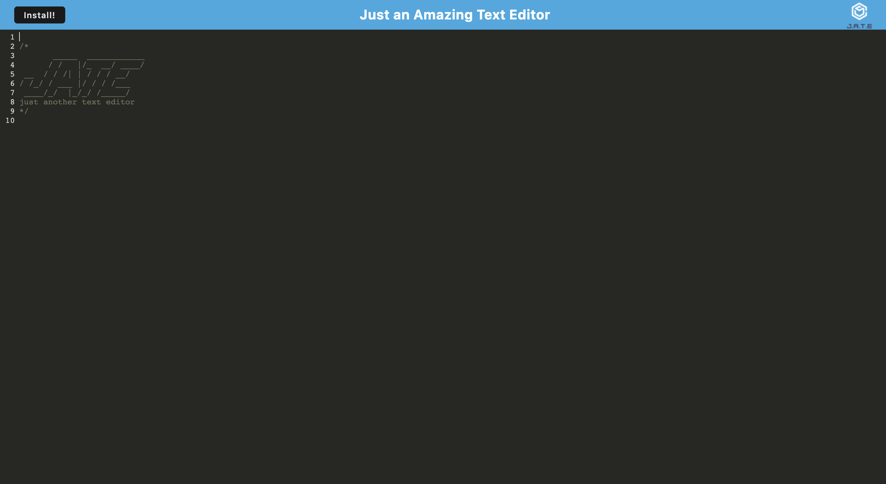
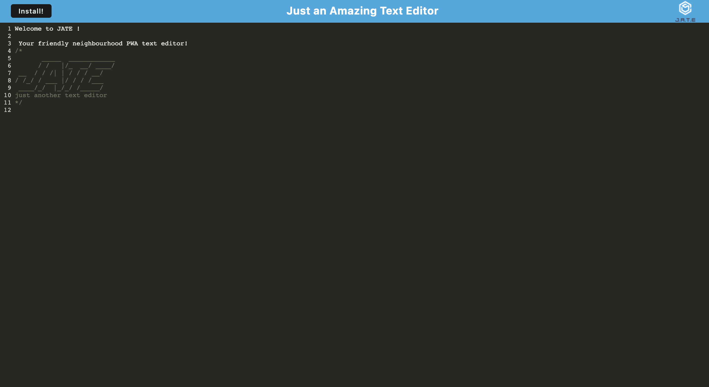
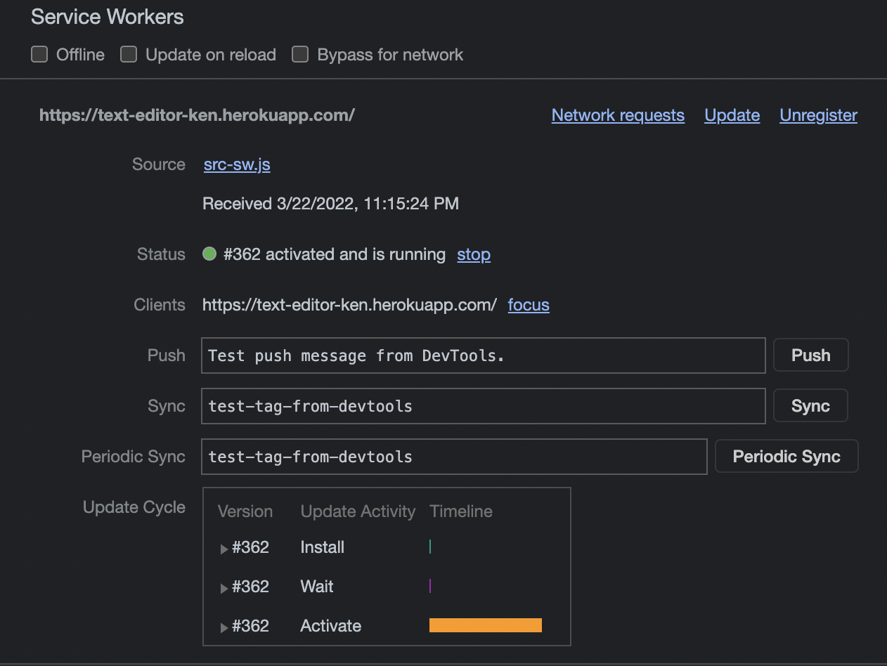

# Text-Editor

## Description

A useful full-stack Node.js Express text editor which utilizes service worker to save user input after reload and upon reinitialization. The text editor is downloadable as a progressive web application to the client's local machine.

## Table of Contents

- [Installation](#installation)
- [Usage](#usage)
- [License](#license)
- [Contribute](#contribute)
- [Questions](#questions)

## Installation

Visit the deployed Heroku application and click the `install` button to save locally to your machine.

[`Link to Text Editor`](https://text-editor-ken.herokuapp.com/)

Alternatively, you can follow the instructions below:

Clone this repository, install Node and then run install to install all dependencies.

`npm install`

Run to build and start the application.

`npm start`

## Usage

Visit the deployed Heroku application

[`Link to Text Editor`](https://text-editor-ken.herokuapp.com/)

## License

This project is under the MIT license.

## Contribute

Contributors can clone the repository and reach out through the contacts provided in the Questions section.

## Questions

  For any questions about this project, please contact me at kenneth.maclean84@gmail.com. 

  Visit https://github.com/DoshPocket to access more of my projects.

  
  
  